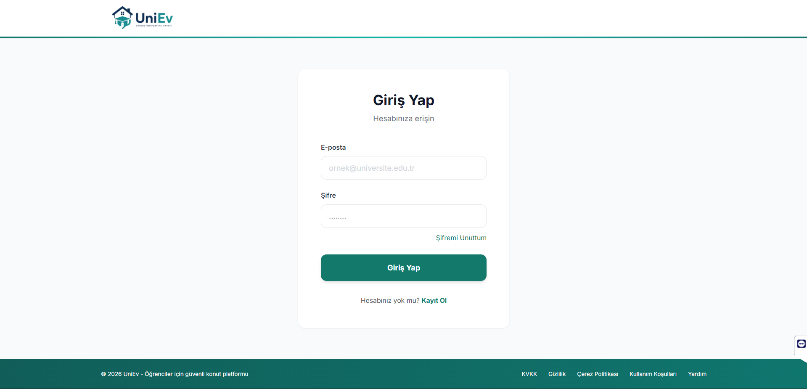
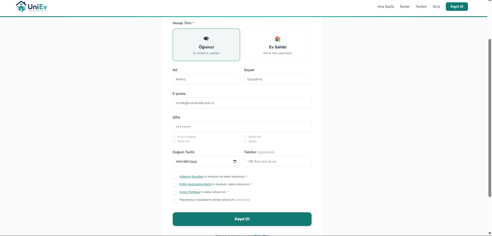
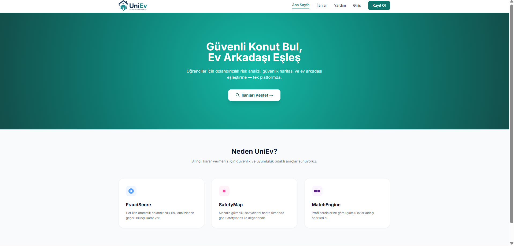
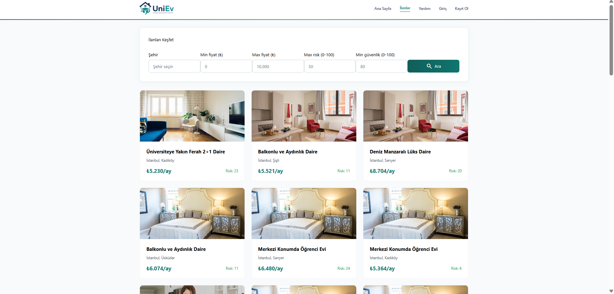
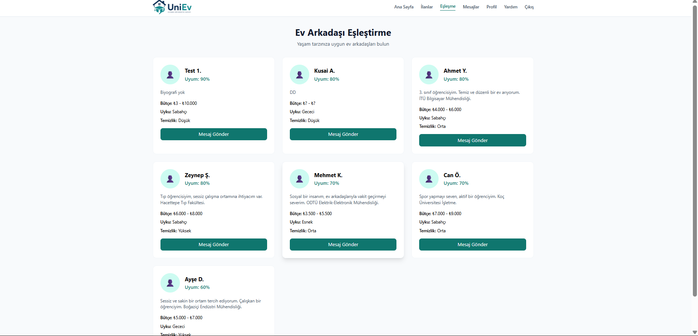
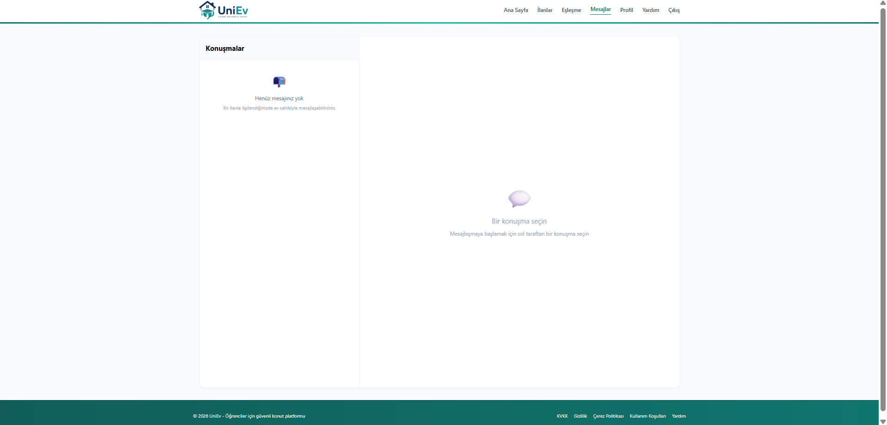
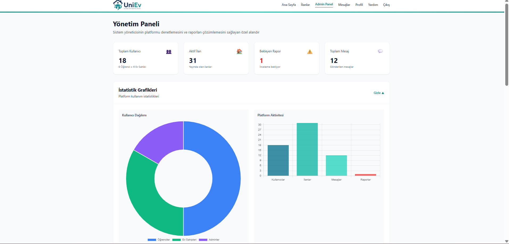

# 🏠 UniEv
## Üniversite Öğrencileri İçin Akıllı Konaklama ve Ev Arkadaşı Eşleştirme Platformu


---

# 📖 Proje Hakkında

UniEv, üniversite öğrencilerinin güvenilir konaklama ilanlarına ulaşmasını, uygun ev arkadaşı bulmasını ve ev sahipleri ile güvenli iletişim kurmasını sağlayan web tabanlı bir platformdur.

Sistem; öğrenciler, ev sahipleri ve yöneticiler için özel olarak tasarlanmış modüller içerir. Platform, konaklama sürecini dijitalleştirerek öğrencilerin daha güvenli, hızlı ve kolay şekilde ev bulmalarına yardımcı olur.

UniEv projesi, Kocaeli Sağlık ve Teknoloji Üniversitesi Yazılım Laboratuvarı II dersi kapsamında geliştirilmiştir.

---

# 🎯 Projenin Amacı

Üniversite öğrencileri yeni bir şehirde eğitim hayatına başladıklarında aşağıdaki problemlerle karşılaşmaktadır:

- Güvenilir ev bulma zorluğu
- Dolandırıcılık riski
- Uygun ev arkadaşı bulamama
- Ev sahipleriyle iletişim problemleri
- Güvenli konum seçimi konusunda bilgi eksikliği

UniEv platformu bu sorunlara çözüm sunmak amacıyla geliştirilmiştir.

---

# 👥 Kullanıcı Rolleri

## 🎓 Öğrenci

- İlan görüntüleme
- İlan filtreleme
- Favorilere ekleme
- Ev arkadaşı eşleştirme
- Gerçek zamanlı mesajlaşma
- Kullanıcı puanlama
- Şikayet oluşturma

## 🏠 Ev Sahibi

- İlan oluşturma
- İlan düzenleme
- İlan silme
- İlan yönetimi
- Öğrencilerle iletişim kurma

## 🛡️ Yönetici (Admin)

- Kullanıcı yönetimi
- Şikayet yönetimi
- İlan denetimi
- Sistem istatistikleri
- İçerik kontrolü

---

# ✨ Temel Özellikler

## 🔐 Kimlik Doğrulama ve Güvenlik

- JWT Authentication
- Argon2 Password Hashing
- Token Yönetimi
- Rate Limiting
- Hesap Kilitleme Sistemi
- CORS Koruması
- KVKK Uyumlu Veri Yönetimi
- Güvenli Oturum Yönetimi

---

## 🏠 İlan Yönetimi

- İlan oluşturma
- İlan güncelleme
- İlan silme
- İlan listeleme
- Çoklu fotoğraf desteği
- Favorilere ekleme
- Arama ve filtreleme
- FraudScore güvenlik puanı

---

## 👥 Ev Arkadaşı Eşleştirme Sistemi

Eşleştirme algoritması aşağıdaki kriterleri kullanmaktadır:

- Bütçe uyumluluğu
- Sigara kullanımı
- Evcil hayvan tercihi
- Uyku düzeni
- Temizlik alışkanlığı
- Yaşam tarzı tercihleri

---

## 💬 Gerçek Zamanlı Mesajlaşma Sistemi

Socket.IO altyapısı kullanılarak geliştirilmiştir.

Desteklenen içerikler:

- Metin mesajları
- Resim gönderimi
- Video gönderimi
- Ses kaydı gönderimi
- Medya dosyaları

---

## ⭐ Kullanıcı Puanlama Sistemi

- Kullanıcı değerlendirme
- Ortalama puan hesaplama
- Güvenilirlik göstergesi
- İtibar yönetimi

---

## 🗺️ Harita ve Konum Hizmetleri

- Google Maps entegrasyonu
- SafetyMap sistemi
- GPS desteği
- Konum seçme
- Konum görüntüleme
- Yol tarifi desteği

---

## 🔔 Bildirim Sistemi

- Toast bildirimleri
- Başarı mesajları
- Hata mesajları
- Bilgilendirme mesajları
- Uyarı mesajları

---

## 📱 Responsive Tasarım

- Mobil uyumlu arayüz
- Responsive tasarım
- Hamburger menü sistemi
- Mobil optimizasyon

---

# 🧪 Test Altyapısı

Projede pytest kullanılarak otomatik test altyapısı oluşturulmuştur.

### Test Kapsamı

- Authentication testleri
- Login testleri
- Register testleri
- Password Reset testleri
- FraudScore testleri
- Güvenlik testleri
- KVKK doğrulama testleri

### Test Sonuçları

- Toplam Test Sayısı: 23
- Başarılı Test Sayısı: 23
- Başarı Oranı: %100

---

# 🚀 Kullanılan Teknolojiler

## Backend

- Python
- FastAPI
- SQLAlchemy
- SQLite
- PostgreSQL

## Frontend

- HTML5
- CSS3
- JavaScript
- Tailwind CSS

## Gerçek Zamanlı Haberleşme

- Socket.IO

## Güvenlik

- JWT
- Argon2

## Test

- Pytest

---

# 📂 Proje Yapısı

```text
UNIEV/
│
├── core/
├── routers/
├── services/
├── sockets/
├── static/
├── templates/
├── uploads/
├── tests/
├── docs/
├── screenshots/
├── database.py
├── main.py
├── requirements.txt
├── .gitignore
└── README.md
```

---

# ⚙️ Kurulum

## 1. Repository Klonlama

```bash
git clone https://github.com/Rama5335/UNIEV.git
```

## 2. Proje Dizini

```bash
cd UNIEV
```

## 3. Sanal Ortam Oluşturma

```bash
python -m venv venv
```

## 4. Sanal Ortamı Aktifleştirme

### Windows

```bash
venv\Scripts\activate
```

### Linux / MacOS

```bash
source venv/bin/activate
```

## 5. Bağımlılıkların Kurulması

```bash
pip install -r requirements.txt
```

## 6. Uygulamayı Başlatma

```bash
uvicorn main:app --reload
```

---

# 📸 Ekran Görüntüleri

## Giriş Sayfası

🔴 BURAYA login.png DOSYASINI EKLEYİN

```markdown

```

## Kayıt Sayfası

🔴 BURAYA register.png DOSYASINI EKLEYİN

```markdown

```

## Ana Sayfa

🔴 BURAYA home.png DOSYASINI EKLEYİN

```markdown

```

## İlan Detay Sayfası

🔴 BURAYA listing-detail.png DOSYASINI EKLEYİN

```markdown

```

## Ev Arkadaşı Eşleştirme Sistemi

🔴 BURAYA match-system.png DOSYASINI EKLEYİN

```markdown

```

## Mesajlaşma Sistemi

🔴 BURAYA messages.png DOSYASINI EKLEYİN

```markdown

```

## Admin Paneli

🔴 BURAYA admin-panel.png DOSYASINI EKLEYİN

```markdown

```

---

# 📈 Proje 3 Kapsamında Yapılan İyileştirmeler

## Refactoring

- Kod yapısı yeniden düzenlendi.
- Modüler mimari geliştirildi.
- Servis katmanı iyileştirildi.
- Kod okunabilirliği artırıldı.

## Kod Temizliği

- Kullanılmayan fonksiyonlar kaldırıldı.
- Tekrarlayan kodlar temizlendi.
- Gereksiz dosyalar kaldırıldı.

## Hata Düzeltmeleri

- E-posta doğrulama sistemi düzeltildi.
- Şifre sıfırlama sistemi yeniden tasarlandı.
- Harita servisleri iyileştirildi.
- Mesajlaşma sistemi geliştirildi.

## Yeni Özellikler

- Toast Bildirim Sistemi
- Mobil Menü Sistemi
- Lightbox Fotoğraf Galerisi
- Kullanıcı Puanlama Sistemi
- Medya Mesajlaşma Sistemi
- SafetyMap Sistemi
- Otomatik Test Altyapısı

---

# 🔮 Gelecekte Yapılabilecek Geliştirmeler

- Yapay zekâ destekli eşleştirme sistemi
- Mobil uygulama geliştirilmesi
- Çoklu dil desteği
- Gelişmiş raporlama sistemi
- E-posta bildirim sistemi geliştirmeleri
- Harita servislerinin genişletilmesi

---

# 👨‍💻 Proje Ekibi

## Takım Adı

CodeForge ŞARJÖR

## Takım Üyeleri

### Kusai Aksoy (230501002)
Takım Lideri

### Hashem Salem (230502064)
Veri Modeli

### Namık Hasan (230501055)
UML Diyagramları

### Rama Hasanatu (230502053)
Arayüz Tasarımı

### Melih Kamil Uslu (230501059)
Dokümantasyon ve Arayüz Tasarımı

---

# 🎥 Lansman Videosu

🔴 BURAYA YOUTUBE / GOOGLE DRIVE VİDEO LİNKİNİ EKLEYİN

Video Linki:

```text
YOUTUBE_VIDEO_LINKI_BURAYA
```

---

# 📄 Dokümantasyon

Proje dokümantasyonları docs klasörü içerisinde bulunmaktadır.

İçerikler:

🔴 AŞAĞIDAKİ DOSYALARI docs/ KLASÖRÜNE EKLEYİN

- Software Requirements Specification (SRS)
- UML Diyagramları
- ER Diyagramı
- Kullanım Senaryoları
- Proje Geliştirme Raporu
- Test Sonuçları

---

# 🎓 Akademik Bilgiler

Üniversite: Kocaeli Sağlık ve Teknoloji Üniversitesi

Fakülte: Mühendislik ve Doğa Bilimleri Fakültesi

Ders: Yazılım Laboratuvarı II

Dönem: 2025-2026

---
